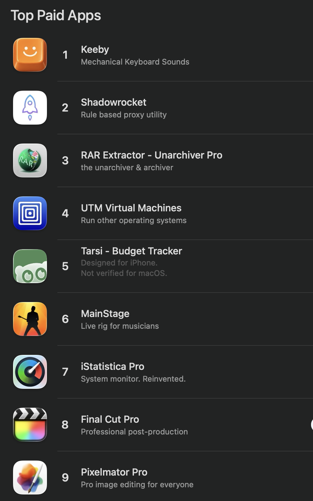

# keeby-web

A public, front-end-only sample of the marketing site for [Keeby](https://getkeeby.com) - a native app that plays realistic mechanical keyboard sounds, which reached **#1 Top Paid on the macOS App Store**.

The live site scores **100 / 100 across all four Lighthouse categories** (Performance, Accessibility, Best Practices, SEO). This repo is a trimmed copy of that same front end, published so the build can be read and run.



## What this is

A [Vite](https://vite.dev) + React 19 + Tailwind v4 single-page marketing site, including:

- A scroll-driven landing page with a macOS-style menu-bar mock and lazy-loaded sections
- An interactive `cobe` WebGL globe (`src/components/Globe.jsx`)
- A reactive notch visualizer (`src/components/NotchVisualizer.jsx`)
- The 2D "Sound Pad" UI, a 1:1 web port of the macOS app's tone pad (`src/components/SoundPad.jsx`)
- A typing playground, a feedback widget, and a live "thock" counter, all built for graceful degradation

## What was intentionally removed

This is a sample, not the production app. The following are **not** included:

- **Sound profiles** - the recorded mechanical switch sounds ship with the commercial app and are its core IP. The Sound Pad and typing UI render fully but are silent here.
- **Payments** - the live site runs a region-aware checkout (PayMongo for PH e-wallets, Polar in USD) with email license-key delivery. None of that code is here; the buy page is a static download CTA pointing at the live product.
- **Backend** - the Supabase-backed thock counter, realtime globe feed, and feedback storage are stripped. The front end seeds a static count and simulates these calls, so everything still renders. No API routes, no `.env`, no keys.

## Run it

```bash
npm install
npm run dev      # http://localhost:5173
npm run build    # production build into dist/
```

## Tech

React 19, Vite, Tailwind CSS v4, `cobe` (WebGL globe), `lenis` (smooth scroll), `lucide-react`.

---

Built by [Adrian Angelo Abelarde](https://abelarde.vercel.app). The live product is at [getkeeby.com](https://getkeeby.com).
